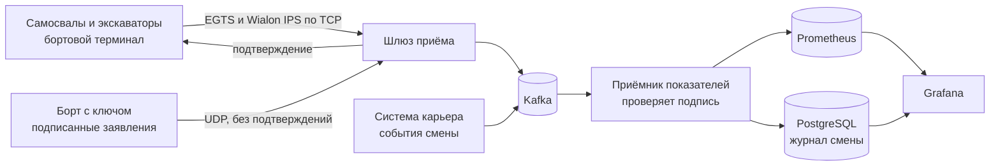
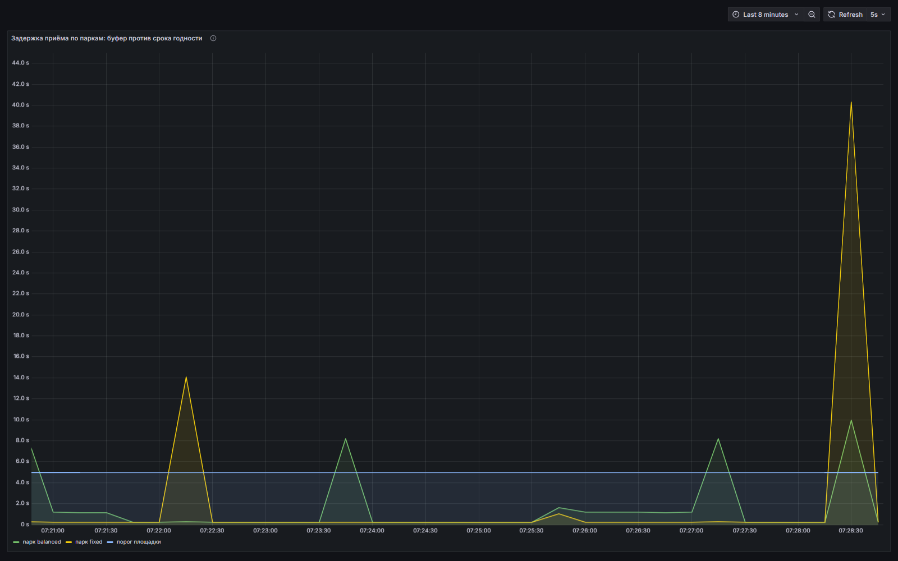
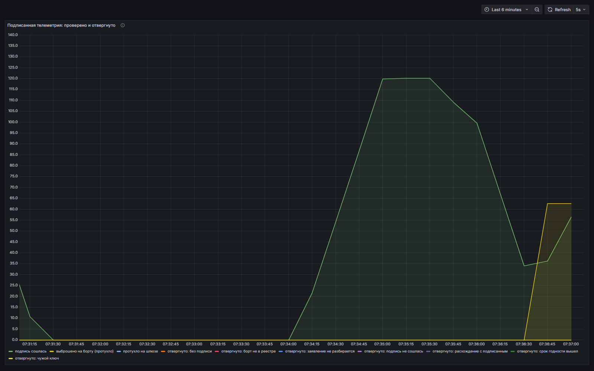

# Карьер: стенд горнотранспортного комплекса

Модель небольшого угольного разреза и приёмный контур телеметрии к нему.
Поднимается одной командой, показывает на дашборде то, ради чего такие системы
внедряют: сколько горной массы вывозит парк, где он теряет время и доходят ли
данные с площадки в заявленный срок.

Дальше та же нагрузка переезжает в кластер Kubernetes, развёрнутый из кода на
трёх машинах **без выхода в интернет**, с выкатом через GitOps из репозитория
внутри периметра. Так выглядит площадка заказчика в горной отрасли: закрытый
контур это там не прихоть, а требование закона о критической инфраструктуре.

## Запустить за пять минут

```bash
git clone https://github.com/temuros/quarry-fleet-lab
cd quarry-fleet-lab
docker compose up -d --build
```

Откройте **http://localhost:3000**, вход `admin` / `quarry`. Первые цифры
появятся через две-три минуты: парку нужно накатать первые рейсы.

Ничего не поднимая, можно прогнать саму модель и кодек протокола:

```bash
python sim/selftest.py 72 8   # 72 часа карьера, 8 парных прогонов, секунды работы
python egts/selftest.py       # проверка протокола EGTS
python wialon/selftest.py     # проверка протокола Wialon IPS
python statement/selftest.py  # третий протокол: подпись, срок годности, подделки
```


## О чём этот репозиторий

| Часть | О чём |
|---|---|
| [Модель карьера](#модель-карьера) | два забоя, парк самосвалов, две стратегии диспетчеризации и на чём модель однажды ошиблась |
| [Три экрана](#три-экрана-три-читателя) | инженеру, диспетчеру и начальнику смены нужны разные вещи |
| [Часть вторая: кластер](#часть-вторая-тот-же-карьер-в-кластере) | Terraform создаёт машины, k3s ставится без интернета на узлах |
| [Часть третья: Kubespray](#часть-третья-обычный-kubeadm-поставленный-kubespray-тоже-без-интернета) | штатный kubeadm-кластер, зеркало контура, 6 минут 45 секунд |
| [Часть четвёртая: GitOps](#часть-четвёртая-gitops-внутри-контура) | git-сервер внутри периметра, ArgoCD откатывает ручные правки |
| [Часть пятая: три протокола борта](#часть-пятая-борт-говорит-по-egts-по-wialon-ips-и-подписанными-заявлениями) | EGTS и Wialon IPS как на реальной технике, третьим подписанная телеметрия |
| [Учения третьего протокола](#учение-обрыв-40-секунд-у-обоих-парков-сразу) | обрыв на два парка сразу и четыре попытки подлога |
| [Часть шестая: копия и авария](#часть-шестая-копия-восстановление-и-учебная-авария) | что копируется, проверка восстановления и хроника гашения узла |
| [Повторить у себя](#повторить-у-себя) | все команды одним списком, тайминги и разбор частых отказов |

В каждой части есть раздел «грабли»: что сломалось на самом деле и почему.
Это и есть основная ценность стенда, всё остальное повторяется по документации.

## Как идут данные



Связь на карьере рвётся, поэтому борт копит записи и досылает их пачками, а
приёмник умеет принимать события задним числом. Событие смены формирует
система, а не терминал: борт передаёт только то, что знает о себе.

Третий протокол устроен иначе нарочно: подтверждений нет, накопленное живёт
до срока годности, зато каждый отсчёт подписан ключом борта, и подпись
проверяется не на входе в периметр, а в самом конце, за шиной.

## Что внутри

```
sim/                модель карьера: два парка самосвалов с разными стратегиями
                    и сторона борта на каждом из трёх протоколов
egts/               протокол EGTS по ГОСТ: кодек, приёмный шлюз на три протокола
wialon/             протокол Wialon IPS: кодек и проверка
statement/          подписанные заявления: кодек, Ed25519, реестр ключей бортов
collector/          приёмник: считает показатели и пишет журнал смены
prometheus/         сбор показателей
grafana/dashboards/ три экрана, заводятся сами при старте

cluster/terraform/  три машины, создаются terraform apply
cluster/offline/    сбор артефактов снаружи и зеркало внутри контура
cluster/kubespray/  профиль кластера и установка через Kubespray
cluster/gitops/     git-сервер внутри контура и ArgoCD
cluster/apps/       манифесты нагрузки: Kafka, PostgreSQL, шлюз, карьер, мониторинг
cluster/scripts/    доставка образов файлом, свой реестр, выкат
cluster/storage/    сетевое хранилище контура и драйвер к нему
cluster/backup/     копия etcd и журнала смен, восстановление с проверкой
cluster/drill/      учения: узел, питание, управление, хранилище, переключение пары
cluster/time/       источник времени внутри периметра
prometheus/alerts.yml  правила тревог, общие для стенда и кластера
```

## Модель карьера

- Два забоя с экскаваторами: уголь идёт на дробилку, вскрыша на отвал.
- Забои намеренно разные. На угле машина крупнее (ковш 22 тонны) и ближе к разгрузке,
  на вскрыше меньше (ковш 15 тонн) и дальше. При одинаковых забоях сравнивать
  стратегии бессмысленно: закрепление самосвалов и так близко к оптимуму.
- Восемь самосвалов грузоподъёмностью 90 тонн в каждом парке.
- Цикл: погрузка ковшами, рейс гружёным, разгрузка, возврат порожняком, очередь у забоя.
- Самосвалы ломаются, экскаваторы встают на ремонт, перегон или взрыв в забое.
  Расписание отказов разыгрывается заранее и одинаково для обеих стратегий,
  иначе сравнение мерило бы не диспетчеризацию, а кому повезло со сломами.
- Время идёт в 60 раз быстрее реального: смена в 12 часов проходит за 12 минут.

Одновременно работают два парка на одном и том же карьере:

| Парк | Стратегия | Что делает |
|---|---|---|
| `fixed` | самосвал закреплён за своим забоем | как возят без диспетчеризации |
| `balanced` | самосвал едет туда, где даст больше тонн в час | прогноз очереди, времени погрузки и плеча откатки |

Разница между ними на дашборде и есть тот эффект, который такие системы обещают.

### Целевая функция, на которой стенд однажды уже ошибся

Первая версия выбирала забой по минимальному ожиданию. Очереди выровнялись,
простой экскаваторов упал, а тоннаж просел: самосвалы уезжали к медленному
экскаватору с длинным плечом просто потому, что там было свободно.

Сейчас назначение считает ожидаемые тонны в час: время подъезда, прогноз
очереди, время погрузки в этом забое и плечо до разгрузки. Поверх лежит план
по вскрыше, потому что возить один уголь нельзя, породу надо снимать.
План задан весом, а не запретом: жёсткий запрет уводил весь парк в один забой
стадом, очередь росла, второй экскаватор стоял.

### Что получается

Прогон 72 часа карьера, восемь парных прогонов, одинаковые отказы у обоих парков:

```
показатель          закреплены за забоем          балансировка
тонн в час                       1944.04               2016.37
время рейса, мин                   21.35                 20.60
простой EX-01                       0.29                  0.10
простой EX-02                       0.06                  0.33

выигрыш по тоннажу: +3.7% в среднем, от +2.3% до +5.2% по прогонам
```

Выигрыш сильно зависит от того, хватает ли самосвалов на забои:

```
Парк      закреплены   балансировка   выигрыш
 4 шт         1004           1069     +6.6%
 6 шт         1508           1601     +6.2%
 8 шт         1925           1991     +3.4%
10 шт         2283           2353     +3.1%
12 шт         2446           2442     -0.1%
14 шт         2583           2572     -0.4%
```

Когда самосвалов в избытке, оба забоя и так загружены, и распределять нечего.
Гибкое назначение окупается там, где техники не хватает, а это и есть обычное
состояние карьера. Отраслевые обзоры внедрений дают 8-15% на больших карьерах
с несколькими забоями и складами, здесь конфигурация маленькая: два забоя.

## Три экрана, три читателя

Один дашборд на всех не работает. В стенде их три, и они отвечают на разные вопросы.

| Экран | Кто смотрит | На какой вопрос отвечает |
|---|---|---|
| **Карьер: горнотранспортный комплекс** | инженер, который отвечает за систему | работает ли поток данных, какая задержка, сколько тонн в час, что даёт балансировка |
| **Смена диспетчера** | тот, кто управляет карьером в смену | как идёт наряд, что делает каждая машина, что с забоями, что случилось только что |
| **Журнал и отчёт по смене** | тот, кто пишет рапорт и разбирает потери | какие были простои и по каким причинам, кто сколько вывез, что выгрузить в CSV |

На диспетчерском экране нет ни одного графика: состояние машины написано
словами («едет гружёным», «ждёт погрузки», «в ремонте»), забой светится
зелёным или красным, ниже лента событий. Диспетчер работает строками, а
не кривыми.


Отчёт по смене отвечает на вопрос «где мы потеряли время»: простои разложены
по причинам, а не свалены в «прочее». На снимке видно, что главная потеря это
не поломки, а забой, простоявший без самосвалов.


### Откуда берутся данные

В стенде телеметрия синтетическая, но набор сигналов тот же, что на машине:
координаты и скорость, состояние, масса в кузове, очередь у забоя, факты
поломок и остановок. На настоящем самосвале это приёмник ГЛОНАСС, бортовой
контроллер, тензодатчики подвески, датчик топлива, давление в шинах и шина
CAN двигателя. Верхний слой, по которому считают производительность, стенд
закрывает целиком; топливо, шины и диагностика пока не моделируются.

### Журнал событий

Отчёт по смене нельзя собрать из Prometheus: там числа во времени, а отчёт
состоит из событий с длительностью и причиной. Поэтому в стенде есть
PostgreSQL: приёмник пишет туда каждое событие (рейс с тоннами и временем
цикла, поломка, остановка забоя, простой забоя без машин, обрыв связи), а
Grafana строит по нему отчёт и отдаёт выгрузку в CSV.

## Канал связи и требования площадки

У парка `balanced` раз в 90 минут карьера канал рвётся на 8 минут. Телеметрия в это
время копится в буфере на площадке и после восстановления догоняется ограниченной
скоростью. На дашборде видно провал потока, рост задержки и последующий догон.

Два показателя вынесены в верхний ряд как SLA площадки:

- доступность потока данных не ниже 95 процентов;
- задержка приёма телеметрии меньше 5 секунд.

Обрыв можно устроить руками в любой момент:

```bash
curl -X POST localhost:8082/outage/start   # канал лёг
curl -X POST localhost:8082/outage/stop    # канал поднялся
curl localhost:8082                        # состояние парка и размер буфера
```

## Что где открывается

| Адрес | Что там |
|---|---|
| http://localhost:3000 | Grafana, три экрана, логин `admin` / `quarry` |
| http://localhost:9090 | Prometheus |
| http://localhost:8000/metrics | показатели приёмника |
| http://localhost:8090/metrics | счётчики шлюза: пакеты, записи, борта на связи, по протоколам |
| http://localhost:8081 | состояние парка `fixed` |
| http://localhost:8082 | состояние парка `balanced` |

Оборвать и вернуть связь у парка, чтобы посмотреть, как борт досылает буфер.
Парки отвечают на это по-разному, потому что говорят разными протоколами:
`fixed` на 8081 досылает всё накопленное, `balanced` на 8082 только то, что
не протухло.

```bash
curl -X POST localhost:8082/outage/start
curl -X POST localhost:8082/outage/stop
curl -s localhost:8082 | python -m json.tool   # буфер, протухло, потеряно
```

Остановка: `docker compose down`, полная очистка с данными: `docker compose down -v`.

## Прогон модели без Docker

Сравнить стратегии, не поднимая ничего:

```bash
python sim/selftest.py 72 8        # 72 часа карьера, 8 парных прогонов
python sim/selftest.py sweep 48 4  # как выигрыш зависит от размера парка
```

Kafka для этого не нужна, прогон занимает секунды.

## Настройка

Переменные задаются в `docker-compose.yml` у сервисов `sim-*`:

| Переменная | По умолчанию | Смысл |
|---|---|---|
| `TRUCKS` | 8 | самосвалов в парке |
| `TRUCK_PAYLOAD_T` | 90 | грузоподъёмность, тонн |
| `SIM_SPEED` | 60 | во сколько раз быстрее реального времени |
| `TELEMETRY_SEC` | 5 | период отправки координат, секунды карьера |
| `DISPATCH` | balanced | `fixed` или `balanced` |
| `OUTAGE_EVERY_MIN` | 90 | период обрыва канала, 0 отключает |
| `OUTAGE_DUR_MIN` | 8 | длительность обрыва |
| `BREAKDOWN_PER_HOUR` | 0.02 | частота поломок самосвала, раз в час |
| `EXC_STOP_PER_HOUR` | 0.06 | частота остановок экскаватора |
| `STRIP_SHARE` | 0.30 | плановая доля вскрыши в вывезенной массе |
| `STRIP_WEIGHT` | 3.0 | насколько сильно план тянет назначение |
| `DISTURBANCE_SEED` | 7 | сценарий отказов, одинаковый для обеих стратегий |
| `TRANSPORT` | egts | чем борт говорит: `egts`, `wialon`, `statement`, `kafka` |
| `STATEMENT_TTL_SEC` | 10 | срок годности отсчёта на третьем протоколе, секунды |

## Показатели

| Метрика | Что означает |
|---|---|
| `quarry_tons_per_hour` | производительность парка, скользящее окно два часа карьера |
| `quarry_cycle_seconds_avg` | среднее время рейса |
| `quarry_wait_seconds_avg` | среднее ожидание под погрузку |
| `quarry_excavator_idle_ratio` | доля простоя экскаватора |
| `quarry_queue_len` | самосвалов в очереди у забоя |
| `quarry_trucks` | самосвалов по состояниям |
| `quarry_stream_uptime_ratio` | доступность потока данных |
| `quarry_ingest_lag_seconds` | задержка приёма телеметрии |
| `quarry_tons_total`, `quarry_cycles_total` | накопительные счётчики |
| `quarry_statement_verified_total` | отсчётов с проверенной подписью |
| `quarry_statement_rejected_total` | отвергнуто при проверке, с причиной |
| `bort_statement_dropped_on_board_total` | выброшено на борту по сроку годности |
| `bort_statement_expired_total` | пришло на шлюз уже протухшим |

## Часть вторая: тот же карьер в кластере

Всё, что выше, поднимается одной командой на одной машине. Дальше та же
нагрузка переезжает в кластер Kubernetes, собранный из кода на трёх узлах
**без выхода в интернет**. Это не упражнение в Kubernetes: так выглядит
площадка заказчика, где софт работает в закрытом контуре.

```
cluster/terraform/   три машины, создаются terraform apply
cluster/k3s/         установка кластера, есть режим без интернета
cluster/apps/        манифесты: Kafka, карьер, реестр, мониторинг
cluster/scripts/     подготовка артефактов, реестр, выкат
```

### Как это собирается

```bash
cd cluster/terraform && terraform apply -var isolated=true   # три машины в сети без выхода наружу
../scripts/stage-artifacts.sh                                # всё нужное скачивается СНАРУЖИ
cd ../k3s && OFFLINE=1 ./install.sh                          # кластер из принесённых файлов
../scripts/configure-registry.sh                             # узлы знают свой реестр
../scripts/seed-registry.sh                                  # образы заезжают внутрь файлом
../scripts/deploy-apps.sh                                    # карьер поехал
```

Проверка, что контур действительно закрыт:

```bash
ssh ubuntu@<узел> "ping -c1 8.8.8.8; curl -m5 https://get.k3s.io"
# ни пинга, ни DNS, ни HTTPS
```

### Что тут показано

| Требование площадки | Как закрыто |
|---|---|
| Кластер разворачивается из кода, а не руками | `terraform apply` создаёт машины, скрипт ставит k3s по адресам из вывода Terraform |
| На узлах нет интернета | Сеть libvirt без выхода наружу, установка из заранее скачанных файлов |
| Внутри контура нет GitLab | Образы собираются снаружи, выгружаются в файл, переносятся `skopeo` в свой реестр |
| Мониторинг внутри периметра | Prometheus и Grafana работают в кластере, наружу ничего не отдают |

### Грабли, которые тут собраны

- **Провайдер libvirt не переносит машину в другую сеть.** Смена сети помечается
  как обновление на месте, интерфейс при этом остаётся в старой сети. Машины
  приходится пересоздавать.
- **Без маршрута по умолчанию k3s не стартует вообще**: он не может выбрать
  адрес узла. В изолированной сети шлюз приходится раздавать отдельно, за ним
  всё равно ничего нет. На реальной площадке так и бывает.
- **Реестр не может взять свой образ из реестра.** `registry:2` кладётся прямо
  в containerd каждого узла через `ctr images import`, и только после этого
  туда заезжает всё остальное.
- **Приёмник в кластере тоже переживает перезапуск парка**: часы карьера идут
  с нуля, и окна показателей сбрасываются, иначе цифры смешивают два прогона.

### Почему libvirt, а не облако

У заказчика на площадке нет облака: там гипервизор или голое железо, иногда
собственный мини-ЦОД. Тот же код без переписывания ложится на Proxmox или
KVM заказчика. Провайдер под конкретное облако выглядел бы красивее в
резюме и хуже соответствовал бы задаче.

## Часть третья: обычный kubeadm, поставленный Kubespray, тоже без интернета

k3s показывает контур, но на площадках стоит штатный Kubernetes, и разворачивают
его как раз Ansible. Поэтому тот же карьер собран ещё раз на kubeadm-кластере,
который ставит **Kubespray**, и так же **без выхода узлов наружу**.

```
cluster/kubespray/   профиль кластера и установка через Kubespray
cluster/offline/     сбор артефактов снаружи и зеркало внутри контура
```

### Как это собирается

```bash
cd cluster/offline
./collect.sh                                  # СНАРУЖИ: файлы, образы, пакеты
./mirror.sh start 192.168.200.1               # зеркало внутри контура

cd ../terraform && terraform apply -var isolated=true
cd ../kubespray && OFFLINE=1 ./deploy.sh      # кластер из зеркала

cd ../scripts && ./seed-registry.sh && ./deploy-apps.sh
```

Перед установкой скрипт сам проверяет каждый узел и **отказывается работать,
если узел достаёт до интернета**: иначе «установка без интернета» ничего не
доказывает.

Последний прогон: кластер **v1.35.4** на трёх узлах, `failed=0`, **6 минут 45
секунд**, все образы пришли из зеркала, ни одного с registry.k8s.io или quay.io.

### Что именно приносится в контур

| Что | Объём | Откуда берётся |
|---|---|---|
| Бинарники кластера: kubelet, kubeadm, etcd, containerd, runc, CNI, crictl | ~410 МБ | `collect.sh` по списку самого Kubespray |
| Образы кластера: kube-*, CoreDNS, Calico, local-path, nginx | ~470 МБ | `skopeo` в хранилище своего реестра |
| Пакеты системы: ebtables, ipvsadm, socat, conntrack, unzip | ~1 МБ | считаются от состава чистого образа |
| Сам реестр (distribution) | 25 МБ | им зеркало и раздаёт образы |

Зеркало внутри контура не требует ни nginx, ни docker: файлы и пакеты отдаёт
`python3 -m http.server`, образы - принесённый бинарник реестра.

### Приём, который экономит день

Чтобы узнать, как образ будет называться внутри контура, список генерируется
**дважды**: без `offline.yml` и с ним. Строки совпадают по порядку, и получаются
пары «откуда взять» → «как назвать в своём реестре». Руками такой список
переписывать нельзя: на 48 образах ошибёшься.

### Грабли офлайна, каждая стоила прогона

- **Проверять состав образа на узле, где Kubespray уже отработал, бесполезно.**
  Половину нужных пакетов он туда и поставил. Состав ЧИСТОГО образа снят в
  `cluster/offline/base-image-packages.txt`, и набор считается от него.
- **Кэш apt на узле «свежий», а зеркало изменилось.** Kubespray пропускает свой
  `apt update`, пока кэшу меньше суток, и падает на «No package matching», хотя
  пакет в зеркале лежит. Офлайн-режим освежает кэш перед прогоном.
- **`nginx` в списке образов нужен не для сайта:** Kubespray ставит его локальным
  балансировщиком до API на каждом рабочем узле. Забыли - установка доходит
  почти до конца и падает.
- **`local-path-provisioner` тянет `busybox` мимо всех настроек реестра**: имя
  зашито в роли, нужна отдельная переменная.
- **Плоскому apt-репозиторию нужно поле `Date`**, иначе apt ругается на каждом
  обновлении, а при строгих настройках отказывается брать репозиторий совсем.
- **`calicoctl` требует процессор уровня x86-64-v2.** QEMU по умолчанию отдаёт
  машине `qemu64` без нужных инструкций, и Calico не стартует: `cpu { mode =
  "host-passthrough" }`. k3s это переживает, kubeadm с Calico нет.
- **kubeadm не приносит хранилище**, в отличие от k3s: без `local-path`
  постоянные тома висят без класса и ничего не стартует.

## Часть четвёртая: GitOps внутри контура

Скрипт выката показывает, что кто-то его запустил, а не что в кластере сейчас.
На площадке, куда инженер попадает по пропуску, это разница между «приезжать на
каждое изменение» и «прислать изменение». Поэтому источником правды становится
**git-репозиторий внутри самого контура**, а ArgoCD сверяет с ним кластер.

```
cluster/gitops/gitea.yaml      git-сервер внутри контура
cluster/gitops/bootstrap.sh    поднять git, залить манифесты, поставить ArgoCD
```

```bash
cd cluster/offline && ./collect.sh gitops   # СНАРУЖИ: манифест и образы ArgoCD, Gitea
cd ../scripts && ./seed-registry.sh         # образы в реестр контура
cd ../gitops && ./bootstrap.sh              # git-сервер, манифесты, ArgoCD
./bootstrap.sh status                       # адреса и пароли
```

**Gitea, а не GitLab.** В каждом закрытом контуре разворачивать GitLab это
отдельный проект с базой, Redis, воркерами и гигабайтами памяти. Здесь нужен
ровно git по HTTP, из которого ArgoCD читает манифесты: один образ и файл базы
на постоянном томе.

**Проверка, что это не просто красивый экран:**

```bash
kubectl -n quarry scale deploy/sim-fixed --replicas=0   # правим кластер руками
# ArgoCD возвращает реплику примерно за 4 секунды: источник правды в репозитории
```

Дальше изменения в кластер вносятся не командой `kubectl apply`, а правкой
файла в репозитории `quarry-apps`: ArgoCD применит сам.

### Как посмотреть глазами

Узлы живут в изолированной сети, и с рабочей машины их адреса не видны: в этом
и смысл контура. Доступ идёт через управляющую машину, как через бастион на
площадке:

```bash
kubectl -n quarry-infra port-forward --address 0.0.0.0 svc/gitea 3030:3000
kubectl -n argocd      port-forward --address 0.0.0.0 svc/argocd-server 3080:80
kubectl -n quarry      port-forward --address 0.0.0.0 svc/grafana 3003:3000
```

### Грабли GitOps, каждая стоила прогона

- **Gitea отказывается работать от root**, а `kubectl exec` заходит в контейнер
  именно root'ом. Её команды нужно запускать через `su-exec git`.
- **Обычный `kubectl apply` не может применить CRD ArgoCD**: kubectl кладёт
  прошлую конфигурацию в аннотацию, а описание ApplicationSet в неё не влезает
  (предел 262144 байта). Помогает `--server-side`.
- **Вырезать dex по вхождению строки нельзя**: сам `argocd-server` ссылается на
  dex в своих аргументах, и грубый фильтр выбрасывал его вместе с dex.
  Фильтровать надо по имени объекта.
- **Дашборды должны лежать в репозитории.** Раньше они превращались в ConfigMap
  командой выката. Всё, чего нет в репозитории, для ArgoCD либо расхождение,
  либо мусор на удаление.

## Часть пятая: борт говорит по EGTS, по Wialon IPS и подписанными заявлениями

Сначала симулятор писал телеметрию прямо в шину. Так не бывает: на площадке
между машиной и системой стоит бортовой терминал и протокол. Теперь парк
говорит по **EGTS** (ГОСТ Р 54619) с приёмным шлюзом, а тот кладёт данные в
шину. Это тот же протокол, на котором работает телематика на реальной технике.

```
борт (EGTS/TCP) -> шлюз -> Kafka -> приёмник -> Prometheus -> Grafana
```

```
egts/protocol.py   кодек: пакеты, записи, подзаписи, контрольные суммы
egts/skhema.py     что борт кладёт в поля и как это читать обратно
egts/gateway.py    приёмный шлюз с подтверждениями и счётчиками
egts/selftest.py   проверка кодека без сети и Docker, занимает секунду
sim/egts_uplink.py сторона борта: буфер, досылка, переподключение
```

Что взято от настоящего терминала:

- **запись хранится, пока сервер не подтвердил приём.** Молчащий шлюз означает,
  что терминалы копят буфер до отказа;
- **обрыв связи не теряет данные:** борт копит записи и досылает пачками, когда
  связь вернулась. Порядок сохраняется, иначе поедет отчёт по смене;
- **соединение восстанавливается само**, с представлением терминала заново.

**События смены по EGTS не идут.** Борт передаёт только то, что знает о себе:
координаты, скорость, показания датчиков. «Рейс закрыт» и «простой начался»
формирует система, и они уходят в шину напрямую, как и на площадке.

**Приёмник показателей не переписан ни на строку.** Смена протокола на борту
не должна доходить до обработки данных, и это проверяется на живом стенде:
после перехода на EGTS задержка приёма осталась 0,2 секунды.

### Грабли этого шага

- **Тег `:local` не меняется от сборки к сборке**, а Kubernetes по умолчанию не
  перекачивает образ, который уже есть на узле. Выкат выглядит успешным, под
  перезапускается, а работает прежний код. Лечится `imagePullPolicy: Always`.
- **ArgoCD опрашивает репозиторий раз в три минуты** и сразу после push честно
  показывает `Synced`: просто про новый коммит он ещё не знает. Без
  принудительного обновления выкат выглядит как «ничего не произошло».
- **`docker.exe` из WSL ищет Dockerfile от своего текущего каталога**, а не от
  того, откуда его позвали. Относительный путь превращается в «файл не найден».
- **Проверка живости порта пишется в журнал как подключение борта.** Каждые
  десять секунд, пока настоящие отключения в нём не утонут.
- **Время в EGTS секундное**, а задержку доставки стенд меряет в долях секунды:
  на секундной сетке этот показатель просто не виден. Миллисекунды едут
  отдельным датчиком.

### Второй протокол борта: Wialon IPS

Утверждение «смена протокола на борту не доходит до обработки» было доказано
один раз, на одном переходе, и потому могло оказаться совпадением. Второй
протокол проверил его делом: парк `fixed` говорил по EGTS, парк `balanced` по
Wialon IPS, и в журнале смены их записи были неразличимы.

⚠️ Цифры ниже сняты на том прогоне. Сейчас парк `balanced` в стенде говорит
третьим протоколом (следующий раздел), а Wialon IPS включается одной
переменной `TRANSPORT: wialon` у любого парка: кодек, шлюз и проверка на месте.

```
wialon/ips.py        кодек: текстовые пакеты, координаты NMEA, параметры
wialon/selftest.py   проверка кодека без сети и Docker, меньше секунды
sim/wialon_uplink.py сторона борта: терминалы, чёрный ящик, догон
egts/gateway.py      один шлюз, два порта: 7777 EGTS, 7778 Wialon IPS
```

Wialon IPS устроен противоположно EGTS: не двоичный, а текстовый, строками
вида `#L#` (вход), `#D#` (данные), `#B#` (досылка из чёрного ящика). На
площадке его понимают терминалы Teltonika, Galileosky, Naviset, и на одном
карьере обычно живут машины с разными прошивками.

**Приёмник показателей, журнал смены и экраны не переписаны ни на строку.**
Оба протокола сходятся в одно сообщение шины в шлюзе, и дальше по потоку
разницы нет. Метрики шлюза переименованы из `egts_*` в `bort_*`: протокол
стал меткой, а не частью имени.

| Показатель | EGTS, парк fixed | Wialon IPS, парк balanced |
|---|---|---|
| Записей в секунду | 89,8 | 115,5 |
| Задержка приёма | 0,93 с | 1,02 с |
| Соединений на парк | 1 | 10, по числу машин |

**Разное число соединений это не изъян реализации, а свойство протокола.** В
EGTS один канал несёт записи многих объектов, номер борта едет в каждой
записи. В Wialon IPS объект называется один раз при входе, и дальше всё
соединение принадлежит ему.

**Проверено обрывом:** канал парка на Wialon погашен на 20 секунд, в
терминалах накопилось 2350 записей, после восстановления они ушли пачками
через `#B#` быстрее, чем удалось снять следующий замер. Потерь ноль.

### Грабли второго протокола

- 🔴 **Отправка в такте модели уронила саму модель.** У EGTS одно соединение
  на парк и один обмен с сервером за такт; у Wialon их столько, сколько
  машин, то есть десять ожиданий ответа шестьдесят раз в секунду. Часы
  карьера пошли **втрое медленнее** соседнего парка, при этом буфер был пуст
  и ни одна метрика канала не жаловалась: всё «работало», просто медленно.
  Дальше отправкой занимается сам терминал, каждый в своём потоке, как
  отдельное устройство на площадке.
- 🔴 **Один поток на все терминалы задержку не вылечил.** Они ждали ответа по
  очереди, очередь копилась волнами, и задержка держалась вдвое выше
  соседнего парка. Помог поток на терминал.
- ⚠️ **Алгоритм Нагла добавляет десятки миллисекунд** протоколу вида
  «запрос, ответ»: ядро придерживает мелкий пакет, ожидая попутных данных,
  а попутных нет, потому что вторая сторона ждёт ответа. `TCP_NODELAY`
  нужен на обоих концах.
- ⚠️ **Параметры в `#D#` это шестнадцатое поле, а не пятнадцатое.** Ошибка
  на единицу не роняет разбор: вместо датчиков читается ключ водителя, все
  показания приходят пустыми, а координаты при этом верные.
- ⚠️ **Координаты в градусах и минутах, как в NMEA.** `5507.4074` это
  55 градусов 7,4 минуты, а не 5507 градусов. Прочитать как обычное число
  значит увезти машину в другое полушарие, и падения при этом не будет.
- ⚠️ **У долготы под градусы три знака, у широты два.** Перепутать значит
  получить разбор, который на малых углах работает, а на больших врёт.
- 🔴 **Доставка образов заливала в общий вход реестра.** Реплик две, у каждой
  своё хранилище: `kube-proxy` разложил куски одной загрузки по разным
  репликам, и она оборвалась на середине с `blob upload invalid`. Это уже
  знал `seed-registry.sh`, а `deliver-images.sh` отстал на одну правку и
  всплыл при первой же доставке после ввода второй реплики.

### Третий протокол борта: подписанная телеметрия

EGTS и Wialon IPS отвечают на вопрос «дошло ли». Оба гарантируют доставку:
борт держит запись, пока сервер не подтвердил приём. Подлинность при этом
обеспечивает канал: кто дозвонился до порта приёма, тот и борт.

На площадке этого хватает ровно до первого спора о смене. Цифры в отчёте
приходят из системы диспетчерской, и подрядчику, у которого не сошлись рейсы,
нечего им противопоставить: данные прошли через периметр, где их могли
поправить, и доказать обратное нечем.

Третий протокол отвечает на другой вопрос: **этот отсчёт правда сформировал
борт 210003, и его после этого не правили**. Форма взята у Parity: statement
store (`substrate/client/statement-store`, `substrate/frame/statement`, в
продуктовом виде Celerity). Маленькое подписанное сообщение с автором, сроком
жизни и приоритетом, без подтверждений и без хранения.

```
statement/zayavlenie.py     кодек: поля, сжатые длины SCALE, тело отсчёта, предел 512 байт
statement/podpis.py         Ed25519 двумя исполнениями: родным и на чистом Python
statement/kluchi.py         ключ борта и реестр открытых ключей
statement/vydat_kluchi.py   выдача ключей: отдельное действие, а не побочный эффект старта
statement/podlog.py         учение: четыре попытки подлога, каждая со своей причиной отказа
statement/selftest.py       проверка без сети и Docker, меньше секунды с родным Ed25519
sim/statement_uplink.py     сторона борта: подпись, UDP, выброс протухшего, отчёт о потерях
egts/gateway.py             тот же шлюз, третий порт: 7779 по UDP
collector/podpisi.py        проверка подписи, реестр, сверка с подписанным
```

**Ничего из Polkadot для этого не нужно.** Взята форма сообщения, не сеть под
ним: ни узла, ни цепочки, ни счетов. В настоящем statement store цепочка
решает две задачи, которых на карьере нет: кто имеет право класть заявления
(в палете это считается от баланса счёта) и как разносить их между узлами.
Здесь право даёт реестр ключей, а разносить некому: приёмник один, внутри
периметра.

**Проверка стоит в приёмнике показателей, а не в шлюзе.** Это не мелочь
размещения. Шлюз это край периметра диспетчерской, и проверка там доказывала
бы, что диспетчерская не подделывает данные сама у себя. Между шлюзом и
приёмником есть шина, и написать в неё может любой, кто до неё дотянулся.
Поэтому заявление едет через шину целиком, в тех же байтах, что подписал
борт, а приёмник сверяет с подписью и пересказ шлюза: совпали поля или шлюз
положил в шину другие цифры.

Заявление весит **204 байта** и уезжает одной дейтаграммой. Подписывается не
всё заявление, а его «материал»: те же поля без поля подписи. В материал
входят канал, тема и приоритет, поэтому по дороге нельзя ни переложить отсчёт
в чужой парк, ни понизить приоритет аварии до обычного. Срок годности лежит
**внутри** подписанного тела: лежал бы рядом, его можно было бы подправить и
оживить протухший отсчёт, не трогая подпись.

| | EGTS | Wialon IPS | Заявления |
|---|---|---|---|
| Транспорт | TCP | TCP | UDP |
| Подтверждения | да | да | нет |
| После обрыва | досылает всё | досылает всё | только то, что ещё годно |
| Подлинность | доверие к каналу | доверие к каналу | подпись Ed25519 в сообщении |
| Соединений на парк | 1 | по числу машин | 0 |
| Размер сообщения | ~60 байт на запись | ~120 байт строкой | 204 байта |

### Учение: обрыв 40 секунд у обоих парков сразу

Парк `fixed` на EGTS и парк `balanced` на заявлениях, канал гасится
одновременно, срок годности отсчёта 10 секунд.

| | EGTS, парк fixed | Заявления, парк balanced |
|---|---|---|
| Буфер на 10-й секунде | 1210 | 1170 |
| Буфер на 40-й секунде | **4830** | **1190** |
| Выброшено по сроку годности | 0 | 3640 |
| Задержка приёма после восстановления | **40,3 с** | **9,96 с** |
| Вернулось к норме | 0,24 с | 0,23 с |

Порог задержки по требованиям площадки 5 секунд. Парк с гарантией доставки
пробивает его в восемь раз и держит пробой, пока не разгребёт буфер: приёмник
в это время разбирает вчерашние координаты вперемешку с текущими. Парк на
заявлениях не выходит за собственный срок годности ни на секунду, потому что
выходить нечему: протухшее выброшено на борту.



**Выброшенное не пропадает молча.** Когда канал вернулся, каждый борт первым
делом отправил подписанный отчёт: сколько отсчётов он выбросил. Десять машин,
десять отчётов, 3640 отсчётов в сумме, и это видно на дашборде отдельной
линией. Без такого отчёта приёмник видел бы просто разрыв в потоке и не смог
бы отличить «борт выбросил протухшее» от «борт сломался».

Ещё 113 заявлений пришли на шлюз уже протухшими: борт отправил их за миг до
истечения срока, а долетели они позже. Их шлюз отбросил сам, в шину они не
попали.

### Учение: диспетчерская дорисовывает рейсы

Защита, которую не пробовали ломать, доказывает только то, что она не мешает
работать. `statement/podlog.py` кладёт в шину четыре сообщения, каждое своим
способом подлога:

```bash
docker cp statement/podlog.py quarry-collector:/app/
docker exec quarry-collector python podlog.py
```

| Попытка | Что сделано | Причина отказа |
|---|---|---|
| Без подписи | сообщение того же вида, что кладёт шлюз, заявления нет | `без подписи` |
| Правка подписанного | настоящее заявление, но в пересказе +50 рейсов | `расхождение с подписанным` |
| Чужой ключ | заявление подписано по-настоящему, но не ключом этой машины | `чужой ключ` |
| Борт не в реестре | машина, которой ключа не выдавали | `борт не в реестре` |

Ни одна из четырёх не попала ни в показатели, ни на экраны. У каждой своя
причина в `quarry_statement_rejected_total`, и на это есть тревога: отсчёт,
не прошедший проверку, означает, что в шину пишет кто-то кроме шлюза.

Цепочка при этом отработала целиком: правило `QuarryStatementRejected`
сработало через две минуты, Alertmanager отдал тревогу приёмнику, и она
легла в журнал смены строкой «в шину идут неподписанные или чужие отсчёты».
То есть попытка подлога попадает не в лог администратора, а туда же, где
начальник смены разбирает простои.



**Что стоит подпись.** Проверка одного отсчёта целиком (разбор заявления,
Ed25519, сверка с пересказом) занимает **0,25 мс** на родном исполнении. При
120 отсчётах в секунду это 3% одного ядра. То же самое на чистом Python
считается 3,8 мс, то есть половина ядра: приёмник начал бы отставать, и
испортился бы ровно тот показатель, ради которого стенд собран.

**Обработка данных не переписана.** Приёмник, журнал смены и три экрана
получили ровно одно изменение: проверку на входе. Сами показатели считаются
тем же кодом, что и для двух других протоколов, и в журнале записи трёх
протоколов по-прежнему неразличимы.

### Грабли третьего протокола

- 🔴 **Борт не может заметить собственное молчание.** Шлюз пересоздали, у него
  сменился адрес, борт продолжил слать дейтаграммы по старому. Ошибки нет: UDP
  не отвечает ничем. На борту при этом идеальная картина, буфер пуст и потерь
  ноль, а данных нет вообще. Терминал на EGTS узнал бы сразу, у него рвётся
  соединение. Лечится двумя вещами: имя приёмника перечитывается по часам, раз
  в 30 секунд, и на приёмной стороне стоит тревога «подписанный парк замолчал».
  Первое это гигиена, второе единственный настоящий способ узнать.
- 🔴 **Счётчик, который рождается в момент события, для `rate()` невидим.**
  Первая точка ряда становится основанием отсчёта, и скачок с нуля до трёх
  тысяч даёт на графике ровный ноль. Панель молчала при заполненном счётчике.
  Хуже графика было бы другое: тревога на подлог по `rate(...) > 0` промолчала
  бы ровно на первом подлоге, то есть тогда, когда она и нужна. Лечится
  заведением всех рядов нулями при старте, включая все причины отказа.
- 🔴 **Смена протокола у парка превращает старые сообщения в шине в подлог.**
  После переключения парка на заявления приёмник прочитал из топика хвост
  прежнего прогона и отверг 220 отсчётов как неподписанные. Он прав: отличить
  старые честные данные от подделки нельзя. Там же нашлась вторая половина
  беды: те сообщения принесли с собой своё время, и задержка приёма показала
  **364 253 секунды**, то есть 4,2 дня, одной точкой на всю панель. Перед
  сменой протокола топик надо чистить.
- ⚠️ **Проброс UDP в Docker пишется явно.** Без `/udp` в `ports` открывается
  порт TCP того же номера, дейтаграммы уходят в никуда, и ошибки нет ни на
  одной стороне. То же в Kubernetes: в манифесте Service и в сетевой политике
  протокол указывается отдельно, и разрешение на TCP 7779 дейтаграммы не
  пускает.
- ⚠️ **Перезапуск приёмника стоит подписанному парку нескольких секунд
  данных.** Приёмник возвращается к незакрытому смещению, а прочитанное уже
  старше своего срока годности: 306 отсчётов ушло в `срок годности вышел`. Это
  не изъян, а следствие правила «протухшее не считаем», и его надо знать
  заранее: у медленного потребителя данные не копятся, а исчезают.
- ⚠️ **Вывод открытого ключа стоит столько же, сколько сама подпись.** На
  чистом Python это 2,1 мс против 1,7 мс. Считать его на каждый отсчёт значит
  удвоить цену подписи на ровном месте: ключ считается один раз на борт.
- ⚠️ **Номер борта, по которому ищется ключ, берётся из подписанного тела, а
  не из пересказа.** Иначе подделыватель называл бы в пересказе одну машину, а
  подписывал телом другой. Из-за этого попытка выдать себя за незаведённую
  машину, оставив в теле чужое имя, отвергается как «чужой ключ», а не как
  «борт не в реестре»: реестр смотрит на тело.
- ⚠️ **Машина, которой не выдали ключ, не попадает в отчёт по смене.** Это
  правильное поведение и неочевидное последствие: завели новый самосвал,
  забыли выдать ключ, и он работает, но в показателях его нет. Поэтому у
  отказа есть отдельная причина `борт не в реестре`, а не общий счётчик.

## Часть шестая: копия, восстановление и учебная авария

Стенд, который ни разу не ломали нарочно, отвечает только на вопрос «а
заведётся ли». На площадке спрашивают другое: что кластер переживёт сам,
сколько диспетчер не будет видеть наряд и где понадобится человек. Ответ
на это даёт не схема, а хроника прогона.

```
cluster/backup/backup.sh    снять копию: etcd, журнал смен, доступы
cluster/backup/restore.sh   вернуть из копии, режим учения внутри
cluster/drill/node-down.sh  погасить узел и записать, что стало
```

### Что копируется, а что и так есть в коде

У стенда три слоя, и восстанавливаются они по-разному:

1. **Код** (Terraform, Kubespray, манифесты) лежит в git и в Gitea внутри
   контура. Копировать нечего: кластер поднимается из кода с нуля, ArgoCD
   раскатывает приложения сам.
2. **Состояние кластера** живёт в etcd. Это снимок, который снимается с
   работающей базы, останавливать ничего не нужно.
3. **Данные приложения**: журнал смен в PostgreSQL. **В снимке etcd их
   нет:** etcd хранит описание тома, а файлы лежат на диске узла. Потерять
   узел с томом и надеяться на снимок etcd это самый частый способ остаться
   без данных.

Копия уезжает с узла на машину оператора: копия на том же диске, что и
оригинал, копией не является. Полная копия стенда занимает 14 МБ.

### Копия, которую проверяли

```bash
cluster/backup/backup.sh           # снять
cluster/backup/backup.sh check     # что внутри и цела ли
cluster/backup/restore.sh ucheniye # удалить журнал нарочно и вернуть из копии
```

Учение с журналом занимает **12 секунд** и заканчивается сверкой: событий в
базе столько же, сколько в копии, штука в штуку.

Восстановление etcd проверено дважды. Чтобы проверка была честной, перед
каждым прогоном в кластере создавалась метка **после** снимка: если после
восстановления она исчезла, значит вернулась копия, а не текущее состояние.
Оба раза метка исчезала.

| Что мерили | Сколько |
|---|---|
| API не отвечал | 8 секунд |
| Всё восстановление etcd целиком | 33 секунды |
| Узлы после восстановления | три из трёх `Ready`, нагрузка не перезапускалась |

**Журнал смен при этом не откатился.** Восстановление etcd вернуло состояние
API, а данные на диске узла остались сегодняшними. Снимок etcd и дамп базы
закрывают разные потери, и подменять один другим нельзя.

Старые данные etcd скрипт не удаляет, а отодвигает в `/var/lib/etcd.otkat`:
если снимок окажется негодным, откатываться будет некуда.

### Грабли копии, каждая стоила прогона

- **`etcdctl` 3.6 отказывается работать, если флаг перекрывает переменную
  окружения** («conflicting environment variable is shadowed»). В
  `/etc/etcd.env` уже лежит `ETCDCTL_ENDPOINTS`, поэтому `--endpoints`
  передавать нельзя: либо флаги, либо переменные.
- **Сколько событий в копии, надо считать по самой копии.** Пока эталон
  снимался с живой базы, сверка не сходилась никогда: приёмник пишет
  непрерывно, и число, снятое через секунду после дампа, в файле уже не
  лежит. Копия, которая говорит о себе неправду, хуже отсутствия копии:
  человек привыкает не смотреть на сверку.
- **В кластере с GitOps писателя нельзя остановить командой `kubectl`.**
  ArgoCD видит, что реплик стало ноль вместо одной, и возвращает приёмник за
  секунды, а тот заново создаёт таблицу и пишет поверх восстановления. На
  время работ приложение переводится в ручной режим и возвращается обратно.
- **`kubectl wait --for=delete` возвращается, когда под ещё доживает:**
  приёмник при остановке сливает накопленную очередь в базу, и эти строки
  приходят уже поверх залитого дампа.
- **Перерыв нельзя мерить после работ.** Опрос, запущенный когда всё уже
  поднялось, показывает ноль секунд и врёт. Наблюдатель стучится в API
  каждую секунду, пока идёт восстановление.

### Учебная авария: гасим рабочий узел

```bash
cluster/drill/node-down.sh quarry-3 6   # погасить на 6 минут и записать хронику
```

Узел гасится жёстко (`virsh destroy`, это выдернутый шнур, а не «выключить»):
питание на карьере пропадает именно так. На `quarry-3` в тот момент жили
журнал смен, Grafana, Prometheus, приёмник, шлюз EGTS, git-сервер и **реестр
образов контура**. Kafka и оба симулятора работали на соседнем узле.

| Событие | Когда |
|---|---|
| Кластер заметил потерю узла | через **42 секунды** |
| Началось выселение подов | через **340 секунд** |
| Узел вернулся в `Ready` после включения | через **32 секунды** |
| Вся нагрузка вернулась | через **85 секунд** |

Событий в журнале до аварии 7597, после 8013: **ничего не потеряно**. Пока
приёмник лежал, телеметрия и события копились в Kafka на живом узле, а после
возврата он дочитал их с сохранённого смещения: отставание группы вернулось
к десятку сообщений. Шина здесь работает ровно так, как задумано на площадке
с рвущейся связью: потребитель может отсутствовать, данные его дождутся.

**Пять минут кластер ничего не предпринимает.** Это не задумчивость: у подов
стоит терпение к недоступному узлу (300 секунд по умолчанию), и всё это время
кластер ждёт, не вернётся ли узел. Перевозить нагрузку раньше дороже, чем
подождать: на площадке узел чаще моргает, чем умирает.

**Поды на мёртвом узле продолжают числиться `Running`.** Их состояние
обновляет kubelet, а он погас вместе с узлом. Диспетчер в этот момент уже не
видит цифр, а `kubectl get pods` показывает, что всё хорошо. Смотреть надо на
узлы, а не на поды.

### Учебная авария посерьёзнее: пропало питание на всём объекте

```bash
cluster/drill/power-loss.sh 2   # погасить ВСЕ узлы разом и записать хронику
```

Гашение одного узла проверяет отказоустойчивость: соседи живы, кластер сам
разбирается. Обрыв питания в серверной выглядит иначе. Гаснет всё и сразу:
управляющий узел, рабочие узлы, диски с базами. Никто ничего не успевает
дописать, сессии не закрываются, кворума нет мгновенно.

| Событие | Первый прогон | Повторный |
|---|---|---|
| Питание вернули, API кластера ответил | 54 секунды | 24 секунды |
| Все три узла `Ready` | 55 секунд | 25 секунд |
| Вся нагрузка вернулась | 97 секунд | 111 секунд |

Человек не понадобился: машины включили, дальше кластер поднялся сам. Журнал
смен читается, событий столько же, сколько было до обрыва, ArgoCD сразу
`Synced / Healthy`, часы после перезагрузки снова взяли время у гипервизора.

**И ровно этот прогон нашёл ошибку, которую не показали ни одиночная авария,
ни двенадцать часов работы.** После подъёма смещения топиков Kafka оказались
нулевыми, а смонтированный том занимал 4 килобайта: образ `apache/kafka` по
умолчанию кладёт журналы разделов в `/tmp/kafka-logs`, и `KAFKA_LOG_DIRS` в
манифесте задан не был. Пока под не пересоздавался, всё выглядело исправно:
данные на месте, том подключён, PVC `Bound`. Первый же перезапуск стирал шину
целиком.

Починено в `cluster/apps/20-kafka.yaml` и проверено повторным обесточиванием:
смещения топиков до обрыва 417 и 16180, после подъёма 426 и 21630, то есть
шина продолжила свой журнал, а не начала его заново.

Это и есть ответ на вопрос, зачем ломать стенд нарочно. Такую ошибку нельзя
увидеть в работающей системе: она проявляется ровно в тот момент, когда на
неё меньше всего хочется наткнуться.

### Что авария показала честно

**Реестр образов внутри контура оказался единственной точкой отказа.** Он жил
на погашенном узле, и выселенные поды на соседних узлах встали в
`ErrImagePull`: образ брать негде. Кластер переживает потерю узла ровно
настолько, насколько его переживает реестр. Починено, разбор ниже.

**Тома `local-path` привязаны к узлу.** Журнал смен, Prometheus, git-сервер и
реестр не переехали и переехать не могли: их данные лежат на диске погашенной
машины. Они дождались возвращения узла. Это честное ограничение стенда с одним
диском на узел, и на площадке оно снимается сетевым хранилищем, а не настройкой.

**После возврата узла часть подов ещё пару минут сидела в `ImagePullBackOff`.**
Реестр уже работал, но пауза между попытками выросла, и поды ждали её конца.
Кластер выглядит сломанным, хотя чинить уже нечего.

**В закрытом контуре некому раздавать время, и часы узлов разъезжаются.**
Это вскрылось при разборе аварии: журнал смен выглядел отставшим на двадцать
минут, хотя писался без задержки. Перезагруженный узел взял верное время у
гипервизора, а два других остались в прошлом: наружу NTP не ходит по условию
задачи, и `timedatectl` честно писал `System clock synchronized: no`. Метку
времени событию ставит тот узел, на котором в этот момент работает приёмник,
поэтому расхождение часов едет прямо в отчёт по смене.

Починено в `cluster/time/setup-time.sh`: источником времени служит сам
гипервизор. Модуль `ptp_kvm` отдаёт гостю часы хоста через `/dev/ptp0`, chrony
держит по ним системное время, наружу по-прежнему не уходит ни одного пакета.
На площадке вместо гипервизора обычно стоит сервер времени в стойке, настройка
та же.

🔴 **Чинится строго в два шага, и порядок обязателен.** Отставшие часы ломают
`apt`: «Release file is not valid yet (invalid for another 21min)», то есть индекс
репозитория выглядит датированным будущим, и apt его не берёт. То есть пакеты,
которыми чинят время, невозможно поставить, пока время не поправлено хотя бы
грубо командой `date`.

**Что пережило аварию без вмешательства:** управление кластером (etcd и API на
другом узле), шина с накопленными данными, оба симулятора, весь журнал смен.
Человек не понадобился ни разу: узел включили, остальное кластер сделал сам.

### Три управляющих узла вместо одного

Раньше кластером управлял один узел, и его потеря останавливала управление.
Теперь управляющих узлов три, и это не щедрость, а арифметика кворума:
**двух узлов было бы мало**. У etcd из двух членов большинство это два голоса,
поэтому потеря любого узла останавливает кластер, то есть второй узел не
добавляет устойчивости, а отбирает её. С тремя членами большинство это два,
и один узел можно потерять.

```bash
cluster/drill/control-plane-down.sh 2   # погасить узел, который держит адрес API
```

| Событие | Когда |
|---|---|
| Управление вернулось через общий адрес | **13 секунд** |
| API не отвечал | **6 секунд** |
| Общий адрес переехал | на соседний узел, сам |
| Кворум etcd | сохранён, два члена из трёх |
| Узел вернулся в `Ready` после включения | 34 секунды |

**Общий адрес API держит kube-vip.** Без него kubeconfig указывает на один
конкретный узел, и его потеря лишает управления, сколько бы управляющих узлов
ни стояло рядом. Адрес живёт на том узле, который сейчас лидер, и переезжает
при отказе.

### Грабли перехода к трём управляющим узлам

Каждая из них стоила прогона, и первые две показали, что «поставить галочку»
мало: кластер выглядел готовым и падал на первой же проверке отказом.

- 🔴 **Все apiserver ходили в etcd по одному адресу.** В конфиге kubeadm
  endpoints было три, а в манифесте `kube-apiserver.yaml` остался один, потому
  что kubeadm не перегенерирует манифест, если файл уже есть. Потеря первого
  узла роняла управление на всех трёх, несмотря на три члена etcd. Лечится
  `kubeadm init phase control-plane apiserver --config ...` на каждом узле.
  Это ровно та же ошибка, что была с реестром: один адрес там, где нужен список.
- 🔴 **Kubespray не умеет превращать рабочий узел в управляющий на месте.** Он
  видит, что kubeadm на узле уже отработал (узел был рабочим), и проверяет
  сертификат API, которого на рабочем узле нет. Штатный путь один: вывести узел
  (`remove-node.yml`) и завести заново уже управляющим.
- ⚠️ **Ошибка на одном узле останавливает весь этап.** Пока один узел падал на
  проверке сертификата, второй молча оставался без установки, хотя в отчёте
  Ansible у него стояло «успешно». Выводить узлы надо все сразу, а не по одному.
- ⚠️ **Сертификат API на новых узлах выпускается без общего адреса**, и обращение
  к нему отвергается как к чужому имени. Сертификат должен быть общим для всех
  управляющих узлов.
- ⚠️ **kube-vip требует строгого ARP** при kube-proxy в режиме ipvs, иначе
  установка останавливается с этим же сообщением.
- ⚠️ **Модуль `ptp_kvm` нужен и здесь:** при расхождении часов узлы не могут
  договориться, а etcd пишет в журнал «prober found high clock drift».

### Сетевое хранилище: данные перестали держаться за машину

Том `local-path` это каталог на диске конкретной машины, и Kubernetes помнит
эту привязку. Пока узел жив, всё хорошо; когда он гаснет, под с журналом смен
переехать не может: на другом узле его данных просто нет. Учение это и
показало, журнал ждал возвращения своей машины.

Теперь данные лежат на хранилище контура, а узлы монтируют его по сети. На
площадке в этом месте стоит дисковый массив в стойке; в стенде его роль
играет шлюз контура, а кластеру всё равно, что именно отдаёт том.

```
cluster/storage/nfs-server.sh      хранилище контура: поднять, посмотреть, снять
cluster/storage/csi-nfs/           драйвер, который учит кластер выдавать тома
cluster/storage/storageclass.yaml  класс quarry-nfs, он же класс по умолчанию
cluster/storage/install.sh         установка и проверка переезда тома
cluster/drill/storage-node-down.sh учение: гаснет узел с журналом смен
```

На сетевое хранилище переехали журнал смен, шина, мониторинг, реестр образов
и git-сервер. `local-path` остался в кластере, но перестал быть классом по
умолчанию: привязка данных к машине должна быть осознанным исключением, а не
тем, что получается само.

### Гаснет узел с журналом смен

**Само по себе гашение узла базу не переносит, и это не недоработка.**
Kubernetes не удаляет поды StatefulSet с недоступного узла: он не знает, умер
узел или просто потерял сеть, а поднять вторую копию базы поверх работающей
первой хуже, чем подождать. Решение принимает человек и выражает его меткой
`node.kubernetes.io/out-of-service`: ею оператор говорит «машина действительно
вышла из строя, переносите».

| Событие | Результат |
|---|---|
| Кластер заметил потерю узла | 71 секунда |
| Журнал, пока решение не принято | ждёт, значится на погасшем узле |
| Переезд после метки `out-of-service` | **41 секунда**, вместе с данными |
| Событий в журнале до и после | **21384 и 21384**, ни одной потерянной записи |
| Узел вернулся в `Ready` | 40 секунд после включения |

Раньше на этом месте журнал ждал возвращения машины, теперь он ждёт только
решения человека.

### Грабли сетевого хранилища

- 🔴 **Подкаталог тома создаётся от root с правами 0755**, и контейнер,
  работающий не от root (а таких большинство), монтирует том и падает на
  ПЕРВОЙ записи: «Error while writing». Выглядит как поломка приложения, а не
  хранилища. Лечится параметром `mountPermissions` в классе хранилища.
- 🔴 **Без `nfs-common` на узле том не монтируется**, а сообщение уводит в
  сторону: «bad option», хотя дело не в опциях, а в отсутствии помощника
  `mount.nfs`. Под при этом висит в `ContainerCreating`, и причина не видна ни
  в одном логе кластера.
- ⚠️ **Тома, описанные отдельным PVC** (мониторинг, git-сервер), не
  пересоздаются сами при смене класса: манифест надо применить заново, иначе
  под остаётся в `Pending` с «persistentvolumeclaim not found».
- ⚠️ **`hard` вместо `soft` в параметрах монтирования** выбран намеренно: при
  потере связи с хранилищем запись должна ждать его возвращения, а не
  завершаться ошибкой. База, получившая ошибку записи на середине, разбирается
  тяжелее, чем база, которая подождала минуту.
- ⚠️ **Метку `out-of-service` обязательно снимать** после возвращения машины:
  пока она стоит, узел остаётся пустым, хотя давно в строю.
- ⚠️ **Проба готовности должна стоить дешевле того, что проверяет.** Шина
  проверялась запуском `kafka-topics.sh`, то есть поднимала JVM на каждую
  проверку: на сетевом хранилище это заняло 24 секунды при таймауте 10. Под
  работал, данные шли, а кластер считал его неготовым. Теперь проверяется порт.
- 🔴 **Сетевого тома мало, нужен ещё и запас ёмкости.** Первое учение
  закончилось тем, что база не переехала вовсе: планировщик ответил
  «Insufficient cpu». После того как все три узла стали управляющими, только
  управляющая часть занимала около 550 мЦПУ на каждом, и переезжать было
  некуда. Узлам добавлено по третьему ядру. Отказоустойчивость это не только
  копии данных, но и место, куда переехать.

### Хранилище из двух машин

Сетевое хранилище развязало данные и узлы, но само осталось в одном
экземпляре и стало последней единственной точкой отказа: его потеря
останавливала не один под, а все базы сразу.

Теперь хранилище это пара машин, и в ней три части:

1. **Реплика диска** между машинами, протокол C: запись подтверждается, только
   когда её приняли обе. Журнал смен не должен терять последние секунды,
   потому что именно в них обычно и случается авария.
2. **Отдача тома** работает только на той машине, что сейчас главная.
3. **Общий адрес** живёт на главной машине и переезжает при отказе. Кластеру
   про переключение знать не нужно: он как ходил на один адрес, так и ходит.

```
cluster/terraform/nas.tf              две машины хранилища из кода
cluster/storage/nas-pair.sh           реплика, общий адрес, перенос данных
cluster/storage/arbitr.sh             третий голос пары на шлюзе контура
cluster/drill/storage-failover.sh     учение: гаснет машина хранилища
```

| Событие | Результат |
|---|---|
| Общий адрес переехал | **8 секунд** |
| Хранилище снова отдаёт том | **8 секунд** |
| Журнал смен во время аварии | продолжил пополняться: 27911 → 27914 |
| Вся нагрузка кластера | не заметила переключения |
| Машина вернулась в строй | 54 секунды |

Клиенты монтируют том с параметром `hard`: при потере сервера запись ждёт его
возвращения, а не падает с ошибкой. Поэтому признак успеха здесь не «в логах
нет ошибок», а «записи продолжились с того же места».

### Грабли резервирования, найденные первым же учением

Первое учение закончилось хуже, чем отсутствие резерва: адрес переехал за 14
секунд, но когда погашенная машина вернулась, она забрала обслуживание обратно
с **неполной копией данных**, и хранилище перестало отдавать том совсем. Вторая
машина при этом была цела и свежа.

- 🔴 **Вернувшаяся машина не должна забирать обслуживание автоматически.** Обе
  объявлены `BACKUP` с `nopreempt`, а готовность проверяется скриптом: машина,
  чья копия не `UpToDate`, на общий адрес не претендует. Обратное переключение
  это решение человека.
- 🔴 **Реплика не поднимается после перезагрузки сама**, если про это не
  сказать: машина выглядит живой, а копии данных на ней нет. Нужен
  `systemctl enable drbd`, и скрипт главного поднимает ресурс явно.
- ⚠️ **Досылка отставшей копии идёт медленно по умолчанию:** восемь гигабайт
  синхронизировались бы около часа. На время восстановления скорость
  поднимается `drbdadm disk-options --resync-rate`.
- ⚠️ **`node-id` в описании ресурса** эти утилиты не понимают: он нужен только
  схемам больше чем на две машины, а ответ невнятный («Parse error … but got
  node-id»), и ресурс просто не собирается.
- ⚠️ **Проверка состояния сама выглядела как поломка.** `exportfs` без `sudo`
  не читает `/var/lib/nfs` и заканчивает вывод строкой `errno 13 (Permission
  denied)`. Хранилище при этом исправно, но человек у экрана верит последней
  строке и идёт чинить то, что не сломано.

### Третий голос: разрыв между машинами перестал быть спором

Двух голосов не хватает по устройству: большинства из них не бывает. Пока
машины видят друг друга, спорить не о чем, DRBD сам не даст двум сторонам
взять том в запись. А когда рвётся канал МЕЖДУ ними, обе живы, обе видят
кластер, и картина у обеих одинаковая: «сосед пропал». Каждая берёт том,
копии расходятся необратимо, и одну из них потом придётся выбросить вместе
со всем, что на неё записали.

Гашение машины этого не показывает: там вторая сторона мертва
по-настоящему, и спорить не с кем. Поэтому первые учения проходили успешно,
а дыра оставалась.

```
cluster/storage/arbitr.py    третий голос: выдаёт право быть главной
cluster/storage/arbitr.sh    запуск на шлюзе контура
cluster/drill/split-brain.sh учение: рвём связь только между хранилищами
```

Арбитр живёт на шлюзе контура, вне обеих машин, и умеет ровно одно: выдать
право одной и не выдать второй, пока первая это право продлевает. Аренда 15
секунд, держатель обновляет её той же проверкой, которой keepalived решает,
годна ли машина.

**Спрашивают его не всегда.** Ведомая машина при живом канале не обращается
к арбитру вовсе. Поэтому упавший арбитр не мешает работе пары: он мешает
только переезду во время разрыва, когда переезжать и не следует.

**Результат учения** (`cluster/artifacts/drills/*-split-brain.txt`): связь
между машинами разорвана правилами iptables, связь с кластером у обеих
сохранена.

| Что проверяли | Результат |
|---|---|
| Машин с томом в записи | **одна**, вторая сняла притязания |
| Общий адрес | на одной машине, начиная с первого замера |
| Журнал смены | 43333 события до, 43464 после, ни одного потерянного |
| После возврата связи | пара сошлась сама, без ручного разбора |

### Грабли третьего голоса, каждая нашлась учением

- 🔴 **Первая версия закрывала не тот случай.** Проверка «вижу ли я хоть
  кого-то третьего» пингом спасает машину, изолированную от всех, но при
  разрыве только между хранилищами обе видят арбитров и обе считают себя
  главными. Голос должен не отвечать на пинг, а выдавать право ровно одному.
- 🔴 **Действующая главная обязана держать право постоянно.** Пока она брала
  его только в момент разрыва, вторая машина успевала забрать замок первой:
  главная ведь ни о чём не просила, она уже была главной.
- 🔴 **VRRP замечает пропажу соседа за три секунды, DRBD за десять.** В эту
  разницу машина считает канал целым, ничего не спрашивает и берёт том,
  пока вторая уже главная. Обе побывали Primary по десять секунд. Лечится
  двумя вещами: право спрашивается ВСЕГДА, а не только при видимом разрыве,
  и `ping-int` у DRBD снижен до трёх секунд.
- ⚠️ **Отказ арбитра и молчание арбитра это разные вещи.** `curl` различает
  их кодом выхода (22 против 7): «занято» означает, что главная уже есть, а
  недоступность означает, что решать надо по состоянию канала. Свести оба
  случая к «не получилось» значит остановить хранилище при падении арбитра.
- ⚠️ **`drbdadm status` не всегда печатает `connection:Connected`:** у
  стороны, видящей живого соседа, там `replication:Established`. Греп по
  первому варианту молча считает соседа пропавшим, и обе машины начинают
  спорить за замок при целом канале. Состояние связи надо спрашивать
  командой `drbdadm cstate`.
- ⚠️ **`drbdadm role` печатает «Primary/Secondary»**, свою роль и роль
  соседа. Сравнение всей строки с `Primary` всегда ложно, и учение
  отчитывается «главных: 0» при любом исходе, включая провальный.

**Это всё ещё не кворум-устройство промышленного уровня.** Настоящее живёт
на третьей машине и голосует вместе с остальными; здесь одна точка,
совмещённая со шлюзом. Выбор осознанный: шлюз это гипервизор, без которого
обеих машин не существует, поэтому его отказ не добавляет нового класса
аварий. На площадке в этом месте ставят ограждение по питанию.

### Тревоги: система научилась сообщать о себе

Четыре учения стенд пережил, но узнавали мы о них только потому, что сами их
и устраивали. На площадке так нельзя: про отказ должен узнать дежурный, а не
тот, кто случайно открыл дашборд.

```
prometheus/alerts.yml         правила: что считается тревогой и почему
prometheus/alertmanager.yml   куда уходит тревога в локальном стенде
cluster/apps/42-alerts.yaml   Alertmanager в кластере
collector/alerts.py           приём тревог и запись их в журнал смены
```

**Тревога едет в журнал смены, а не только в почту.** Отчёт по смене отвечает
на вопрос «почему вывезли меньше, чем собирались», и половина ответов это не
поломки техники, а отказы самой системы: встал приёмник, оборвался канал,
кончилось место. Если такие события живут отдельно, разбор смены превращается
в сопоставление двух списков по часам. Поэтому тревога попадает в ту же ленту,
что и «машина встала»: диспетчер видит её у себя на экране, а начальник смены
находит в отчёте.

Наружу почта не ходит по условию задачи. На площадке рядом с этим получателем
встаёт почтовый релей периметра или шлюз в систему дежурства; заготовка лежит
в конфигурации закомментированной.

| Правило | Когда срабатывает | Почему это важно |
|---|---|---|
| `QuarryTelemetryStopped` | телеметрии нет 3 минуты | смена считается по бумаге |
| `QuarryEventsStopped` | событий смены нет 5 минут | наряд в отчёте будет неполным |
| `QuarryIngestLagHigh` | задержка приёма выше 2 секунд | экран диспетчера показывает прошлое |
| `QuarryQueueGrowing` | очередь записи больше 2000 | журнал не успевает писать |
| `QuarryCollectorDown` | приёмник молчит 2 минуты | не считаются ни тонны, ни простои |
| `QuarryGatewayDown` | шлюз молчит 2 минуты | борта копят записи в буфере |
| `QuarryNodeDown` | узел молчит 3 минуты | нужна метка `out-of-service`, иначе тома не переедут |
| `QuarryShiftBehindPlan` | вывезено меньше 3/4 плановой доли | единственная тревога не про технику, а про результат |

**Правило здесь появляется, только если на него есть ответ:** кому звонить и
что делать. Тревога, на которую никто не реагирует, обучает людей не смотреть
на тревоги вообще, и тогда пропускается та единственная, которая важна.

**Проверено не искусственной поломкой, а собственным отказом стенда.** После
ночи учений задержка приёма держалась около пяти секунд при договорных двух,
`QuarryIngestLagHigh` сработало само, и запись появилась в журнале:

```
ts                     kind     who                              reason
2026-09-18 21:08:45    тревога  задержка приёма выше договорной  Данные доходят дольше двух
                                                                 секунд. Экран диспетчера
                                                                 показывает прошлое.
```

### Грабли тревог

- ⚠️ **Снятие тревоги надо писать наравне с её началом.** Без этого в отчёте
  видно, что началось, и не видно, когда закончилось, а длительность и есть
  главный вопрос при разборе смены.
- ⚠️ **Следствия подавляются, иначе один отказ даёт пачку записей.** Пока
  приёмник лежит, отдельная тревога «данные не идут» это не вторая авария.
- ⚠️ **Новый модуль надо добавить в `Dockerfile`:** файлы перечисляются
  поимённо, образ собирается молча, а падает уже в кластере на
  `ModuleNotFoundError`.
- 🔴 **Тревога сравнивала порог сам с собой.** `QuarryIngestLagHigh` был
  записан как `quarry_sla_lag_seconds > 2`, но эта метрика не замер, а
  константа из требований площадки, равная пяти. Условие «5 > 2» истинно
  всегда, и тревога горела сутки при задержке в 0,7 секунды. Правило,
  которое невозможно погасить, обучает не смотреть на тревоги вообще, то
  есть работает ровно против того, зачем его ставили. Сравнивать надо замер
  с порогом: `quarry_ingest_lag_seconds > on(instance, job) group_left()
  quarry_sla_lag_seconds`.
- 🔴 **Prometheus не перечитывает правила сам.** Обновлённый ConfigMap
  доезжает до пода, файл на диске меняется, ArgoCD показывает Synced, а в
  памяти живут прежние правила. Худший вид отказа: система утверждает, что
  изменение применено, и это неправда. Лечится без ручного reload, суммой
  правил в аннотации шаблона пода: меняются правила, меняется шаблон,
  ArgoCD пересоздаёт под. Подставляет её `cluster/gitops/bootstrap.sh`.
- ⚠️ **Деплойменту с диском нужна стратегия `Recreate`.** При обычной
  выкатке новый под стартует раньше, чем старый отпустил том, и падает с
  `lock DB directory: resource temporarily unavailable`. Само чинится
  следующей попыткой, но каждая правка правил даёт минуту красного пода.
- ⚠️ **После перезапуска Prometheus снятие тревоги приходит с опозданием.**
  Перезапущенный Prometheus не помнит, что тревога горела, и resolve не
  шлёт. Alertmanager дожидается истечения срока тревоги, а «тревога снята»
  уезжает в журнал на следующем тике группы, то есть через `repeat_interval`:
  на стенде ровно через час после записи о начале. Ждать этого молча
  страшно, поэтому строка стоит здесь.

### Реестр, переживающий потерю узла

Учение показало, что раздача образов была слабее всего остального, и слабой
она была дважды.

**Во-первых, реестр существовал в одном экземпляре.** Теперь это StatefulSet
из двух реплик с жёстким запретом жить на одном узле
(`requiredDuringScheduling`, а не `preferred`: реестр, обе копии которого
уехали на одну машину, это тот же единственный экземпляр, только дороже).

**Во-вторых, и это было опаснее, все узлы ходили за образами на NodePort
одного узла.** Падал он, и образы переставали скачиваться на всём кластере,
даже когда сам реестр был жив на другой машине. Резерв в такой схеме не
помогает вовсе. Теперь `NodePort` слушает на каждом узле, а в настройке
containerd перечислены адреса всех узлов, свой первым: запрос идёт к себе,
kube-proxy доводит его до любой живой реплики, а если локальный узел не
отвечает, containerd пробует следующий адрес из списка.

```bash
cluster/scripts/seed-registry.sh       # наполнить ОБЕ реплики и сверить
cluster/scripts/configure-registry.sh  # раздать узлам адреса, свой первым
```

**Общего тома на несколько узлов в стенде нет**, поэтому каждая реплика держит
свою полную копию, а наполнять надо обе поимённо: через общий вход kube-proxy
разложил бы образы по репликам как ему удобнее, и каждая осталась бы наполовину
пустой. Такой реестр хуже одного: выкаты начнут падать через раз, а причина
будет выглядеть случайной. Поэтому у каждой реплики свой отдельный вход, а в
конце заливки скрипт сверяет каталоги и отказывается считать работу сделанной,
если они разошлись.

**Проверено отказом, а не рассуждением.** Узел `quarry-2` с репликой
`registry-0` погашен жёстко; после того как кластер увидел его недоступность,
на `quarry-3` запущен под с `imagePullPolicy: Always` и образом из реестра
контура. Образ скачался, под запустился **за 4 секунды**. После возвращения
узла обе реплики на месте и их каталоги совпадают.

## Часть седьмая: bash превращается в роли

Скрипт отвечает на вопрос «что сделать». Роль отвечает на вопрос «как должно
быть». Разница не в красоте, а в том, что можно узнать: скрипт делает всё
заново и молчит о результате, роль на втором прогоне сообщает, что менять
нечего. На площадке с полусотней машин это разница между «выкатили» и
«выкатили и знаем, что получилось».

```
cluster/ansible/inventory/quarry.py   список машин из вывода terraform
cluster/ansible/site.yml              весь стенд одним прогоном
cluster/ansible/roles/vremya          часы от гипервизора
cluster/ansible/roles/reestr          адреса реестра для узлов
cluster/ansible/roles/hranilishche    реплика диска, общий адрес, отдача тома
```

```bash
cd cluster/ansible
ansible-playbook site.yml                   привести стенд к описанному
ansible-playbook site.yml --check --diff    показать, что изменится
ansible-playbook site.yml --tags vremya     только часы
```

**Инвентарь не записан руками.** Машины берутся оттуда же, откуда их берёт
terraform: `inventory/quarry.py` читает `terraform output`. Машину
пересоздали, адрес сменился, инвентарь знает об этом сразу, и не остаётся
второго места, где тот же факт записан по-другому.

**Разрушительное выключено по умолчанию.** Сборка метаданных DRBD и создание
файловой системы стирают том: на пустых машинах это установка, на работающем
хранилище потеря всех баз разом. Поэтому они включаются явно,
`-e nas_pervaya_ustanovka=true`, а обычный прогон настраивает и чинит
конфигурацию, не прикасаясь к данным.

### Что роли нашли на живом стенде в первый же прогон

Перевод в роли задумывался как уборка. Он нашёл три расхождения между тем,
что было задумано, и тем, что на самом деле стояло на машинах.

- 🔴 **Все три узла ходили за образами на адрес одного узла.**
  `configure-registry.sh` раздаёт адреса «свой первым», но выполнялся он,
  когда узел был один; двух других тогда ещё не существовало. Скрипт
  отработал успешно и больше никогда не запускался, а настройка осталась
  такой, какую чинили после учения с гашением узла. Роль показала это в
  первом же `--check`, потому что сравнивает желаемое с текущим, а не
  выполняет команды вслепую.
- 🔴 **На машинах хранилища часы не держал никто.** `setup-time.sh` обходит
  узлы кластера через `kubectl get nodes`, а хранилище в кластер не входит:
  обе машины остались без chrony и без источника времени вообще. Метку
  времени журналу ставит приёмник, но время файлов, журналов DRBD и NFS
  берётся отсюда. У ролей инвентарь общий на весь стенд, и дыры не осталось.
- 🔴 **Плановое переключение хранилища не работало.** Это худшее из трёх и
  нашлось, только когда роль перезапустила keepalived на живой паре. При
  гашении машины вторая сторона мертва мгновенно, и новая главная берёт
  `drbdadm primary` с первой попытки. При плановом переключении обе машины
  живы, и адрес переезжает на секунду раньше, чем прежняя главная успевает
  стать ведомой. Скрипт `quarry-nas-glavnyy` падал на отказе, `set -e`
  обрывал его, и хранилище оставалось вообще без хозяина, хотя обе машины
  были целы. Учения этого не видели, потому что всегда гасили машину.

  Починка: ждать, пока вторая сторона отпустит роль, до 30 секунд. Проверено
  двумя переездами подряд, `стал главным, том отдан` через 4 и через 2
  секунды после получения адреса. Заодно добавлен `notify_stop`: машина,
  выведенная на обслуживание командой `systemctl stop keepalived`, раньше
  отдавала адрес, но продолжала держать том в режиме записи.

### Грабли перевода в роли

- ⚠️ **`--check` пропускает любую команду**, и роль остаётся без данных,
  которые собирала командой: сравнение пустых строк тихо решает, что всё в
  порядке. Читающим командам нужен `check_mode: false`.
- ⚠️ **Права `0777` на каталоге тома это не небрежность.** На главной машине
  это корень смонтированного тома, и в него пишут контейнеры со своими
  идентификаторами. Роль, приводящая его к «приличным» `0755`, останавливает
  базы на следующем запуске.
- ⚠️ **Пару обслуживают по одной машине и начиная с запасной.** `serial: 1`
  и `order: reverse_sorted`: иначе адрес переедет на машину, которую ещё не
  обновили, или обе одновременно окажутся в перезапуске.
- ⚠️ **Идемпотентность это не эстетика, а способ проверки.** Пока второй
  прогон показывает `changed`, роль не описывает состояние машины, и её
  отчёту нельзя верить. Сейчас второй прогон по всем пяти машинам даёт
  `changed=0`.

## Часть восьмая: сеть подов перестала быть плоской

Периметр контура был закрыт снаружи с самого начала: сеть изолирована, с узлов
нет ни пинга, ни DNS, ни HTTPS. Внутри же до базы журнала мог подключиться
любой под кластера. На площадке это и есть типичный путь после проникновения:
попали в один под, дальше идут по открытым портам соседей.

```
cluster/apps/50-network-policies.yaml         кого пускать к поду
cluster/apps/51-network-policies-egress.yaml  куда пускать сам под
```

Сделано в два захода намеренно: сначала входящий трафик, проверка, потом
исходящий. Ошибка в одном не роняет сразу всё, и видно, какой заход что сломал.

**Учение, без которого политика недоказуема.** Пустой `NetworkPolicy` выглядит
ровно как работающий, поэтому в namespace поднимается посторонний под и пробует
то, что ему не положено:

| Кто и куда | Результат |
|---|---|
| посторонний под → журнал `postgres:5432` | отказ, 8 с молчания |
| посторонний под → шина `kafka:9092` | отказ, 8 с молчания |
| посторонний под → зеркало контура `192.168.200.1:5000` | отказ |
| посторонний под → `grafana:3000` | отказ |
| приёмник → журнал и шина | открыто за 0,065 и 0,031 с |

Имя `postgres.quarry.svc.cluster.local` посторонний под при этом разрешает в
адрес: отказ именно сетевой, а не «сервис не нашёлся».

### Грабли сетевых политик

- 🔴 **Разрешения на kube-dns мало.** Kubespray ставит `nodelocaldns`, и в
  `/etc/resolv.conf` пода стоит не адрес службы CoreDNS, а link-local адрес
  кэша на самом узле, `169.254.25.10`. Правило с `namespaceSelector` на
  kube-system его не покрывает: это вообще не под. Нужен `ipBlock` на этот
  адрес.
- 🔴 **Отказ DNS маскируется работающей системой.** Уже открытые соединения
  живут в conntrack и не рвутся: журнал продолжал расти, будто всё в порядке.
  Сломался только Prometheus, который разрешает имя на каждый съём, и потерял
  две цели из пяти с невнятным `context deadline exceeded`. Перезапусти в тот
  момент любой под, он бы не поднялся. Проверять надо не «работает ли сейчас»,
  а «поднимется ли заново»: после починки один под гасится нарочно.
- 🔴 **Экраны ломаются молча.** `kubectl port-forward` открывает соединение от
  kubelet с адреса узла, NodePort приходит после подмены адреса. Политика вида
  «пускать только от Prometheus» оставляет Grafana с висящей страницей и без
  единой ошибки в логах. У каждого экрана отдельное правило на сеть контура.
- ⚠️ **Тома NFS монтирует kubelet, а не под:** хранилище этими правилами не
  закрывается и ими же не ломается.
- ⚠️ **Поды в сети узла политикам не подчиняются вовсе** (apiserver,
  kube-proxy, calico-node, kube-vip). «Закрыть всё внутри кластера» невозможно,
  и знать эту границу честнее, чем считать её закрытой.
- ⚠️ **Prometheus ходит не только за показателями:** список узлов он берёт у
  apiserver по адресу службы `kubernetes`, а сами показатели снимает с kubelet
  на узлах по 10250. Забыть любое из двух значит потерять цели и не заметить.

**Реестр, git-сервер и ArgoCD оставлены открытыми намеренно.** Реестр принимает
обращения от containerd с узлов, ArgoCD ходит в apiserver: закрыть их можно, но
риск сломать выкат образов выше пользы, а показать это нечем. Решение записано
здесь, чтобы не выглядело забывчивостью.

## Повторить у себя

Всё, что описано выше, собирается из кода. Здесь команды одним списком, чтобы
не собирать их по разделам.

**Что нужно.** Linux с включённой аппаратной виртуализацией (`/dev/kvm` на
месте) или WSL2 с той же возможностью, около 12 ГБ свободной памяти, 60 ГБ
диска, установленные Terraform, Ansible с Kubespray, `skopeo` и Docker для
сборки образов. Интернет нужен только на первом шаге: дальше узлы отрезаны.

**Сколько это занимает.** Сбор артефактов около гигабайта, 10-20 минут в
зависимости от канала. Создание машин минута. Кластер 7 минут на четырёх
ядрах. Выкат нагрузки и GitOps ещё 5 минут.

```bash
git clone https://github.com/temuros/quarry-fleet-lab && cd quarry-fleet-lab

# 1. СНАРУЖИ контура: принести всё, что понадобится внутри
cd cluster/offline
./collect.sh            # файлы кластера, образы, системные пакеты
./collect.sh gitops     # ArgoCD и Gitea

# 2. Зеркало внутри контура: файлы, пакеты, образы
./mirror.sh start 192.168.200.1

# 3. Три машины из кода, в сети без выхода наружу
cd ../terraform
terraform init
terraform apply -auto-approve -var isolated=true

# 4. Кластер из зеркала. Перед установкой скрипт сам проверяет,
#    что узлы НЕ достают до интернета, и отказывается идти, если достают
cd ../kubespray && OFFLINE=1 ./deploy.sh

# 5. Образы карьера внутрь контура и выкат
cd ../scripts
./deliver-images.sh     # собрать снаружи, выгрузить в файл, положить в реестр
./seed-registry.sh      # наполнить реестр внутри контура
./deploy-apps.sh        # Kafka, PostgreSQL, шлюз EGTS, карьер, мониторинг

# 6. GitOps: git-сервер внутри контура и ArgoCD над ним
cd ../gitops && ./bootstrap.sh && ./bootstrap.sh status
```

**Проверить три протокола борта, не поднимая ничего:**

```bash
python egts/selftest.py       # EGTS по ГОСТ
python wialon/selftest.py     # Wialon IPS
python statement/selftest.py  # подписанные заявления: подделки, срок годности, реестр
```

**Повторить оба учения третьего протокола на поднятом стенде:**

```bash
# обрыв на два парка сразу: один досылает всё, второй только годное
curl -X POST localhost:8081/outage/start && curl -X POST localhost:8082/outage/start
sleep 40
curl -X POST localhost:8081/outage/stop && curl -X POST localhost:8082/outage/stop
curl -s localhost:8000/metrics | grep quarry_ingest_lag

# четыре попытки подлога, каждая со своей причиной отказа
docker cp statement/podlog.py quarry-collector:/app/
docker exec quarry-collector python podlog.py
curl -s localhost:8000/metrics | grep quarry_statement_rejected
```

**Как посмотреть.** Узлы живут в изолированной сети, поэтому доступ идёт через
управляющую машину, как через бастион на площадке:

```bash
export KUBECONFIG=$PWD/cluster/kubespray/kubeconfig
kubectl -n quarry       port-forward --address 0.0.0.0 svc/grafana 3003:3000
kubectl -n argocd       port-forward --address 0.0.0.0 svc/argocd-server 3080:80
kubectl -n quarry-infra port-forward --address 0.0.0.0 svc/gitea 3030:3000
```

**Как убедиться, что контур действительно закрыт:**

```bash
ssh ubuntu@<адрес узла> 'curl -m5 https://registry.k8s.io; ping -c1 8.8.8.8'
# ни HTTPS, ни пинга: всё, что работает в кластере, приехало файлом
```

**Как проверить, что источник правды это репозиторий, а не кластер:**

```bash
kubectl -n quarry scale deploy/sim-fixed --replicas=0   # правим руками
# ArgoCD возвращает реплику примерно за четыре секунды
```

**Как снести:** `cd cluster/terraform && terraform destroy -auto-approve`.
Машины и всё, что на них, исчезают; собранные артефакты остаются в
`cluster/artifacts` и при следующем прогоне качаться заново не будут.

### Если что-то не пошло

| Симптом | Где смотреть |
|---|---|
| Установка падает на `Manage packages` | пакета нет в зеркале: `cluster/offline/collect.sh apt`, состав чистого образа в `base-image-packages.txt` |
| Под висит в `ImagePullBackOff` | образа нет в реестре контура: `curl http://<узел>:30500/v2/_catalog` |
| Выкат прошёл, а работает прежний код | тег `:local` не изменился, нужен `imagePullPolicy: Always` |
| ArgoCD показывает `Synced`, а изменений нет | он ещё не перечитал репозиторий: `kubectl -n argocd annotate app quarry argocd.argoproj.io/refresh=hard --overwrite` |
| Calico не стартует, ругается на процессор | в Terraform нужен `cpu { mode = "host-passthrough" }` |
| Машины не поднялись после перезагрузки | WSL гасит дистрибутив: `wsl -d Ubuntu -u root -e bash -lc 'virsh start quarry-1'` |
| `etcdctl` ругается на «shadowed» переменную | адрес уже задан в `/etc/etcd.env`, флаг `--endpoints` передавать нельзя |
| После восстановления журнал не сходится с копией | писателя вернул ArgoCD: перевести приложение в ручной режим на время работ |
| Под висит `Pending` после возврата узла | том `local-path` привязан к узлу, под ждёт именно его |
| Потеря первого узла роняет управление | в манифесте apiserver один адрес etcd: `kubeadm init phase control-plane apiserver --config ...` |
| Kubespray падает на `Check apiserver.crt SAN` | рабочий узел нельзя сделать управляющим на месте: вывести и завести заново |
| `ErrImagePull` на узле, хотя реестр жив | узел ходит по одному адресу: `cluster/scripts/configure-registry.sh` раздаёт все |
| Образ есть в одной реплике реестра и нет в другой | заливали через общий вход, надо `seed-registry.sh` в оба входа |
| После переезда базы журнал перестал пополняться | приёмник держит мёртвое соединение: `kubectl -n quarry delete pod -l app=collector` |
| Под не переезжает, «Insufficient cpu» | на оставшихся узлах нет запаса ёмкости: добавить ядер узлам |
| Под работает, данные идут, а он `0/1` | проба дороже проверяемого: запуск JVM не укладывается в таймаут, нужна проверка порта |
| Хранилище перестало отдавать том после возврата машины | обслуживание забрала машина с неполной копией: нужен `nopreempt` и проверка `UpToDate` |
| `terraform plan` предлагает снести сеть и машины | запуск без ключей, которыми стенд создавался: значения по умолчанию должны совпадать с реальным запуском |
| Подписанный парк молчит, а на борту буфер пуст и потерь ноль | борт слал дейтаграммы по старому адресу шлюза: UDP об этом не сообщает. Проверить `bort_connections{protokol="statement"}` |
| Все подписанные отсчёты уходят в `срок годности вышел` | разошлись часы борта и приёмника больше чем на срок годности |
| Отсчёты парка отвергаются как `борт не в реестре` | машине не выдали ключ: `python statement/vydat_kluchi.py` |
| Панель по подписи пустая, хотя счётчик не ноль | ряд появился в момент события, `rate()` его не видит: заводить нулями при старте |

## Дальше по плану

1. Ingress и постоянные имена вместо проброса портов: на площадке в контур
   ходят так, а не через управляющую машину.
